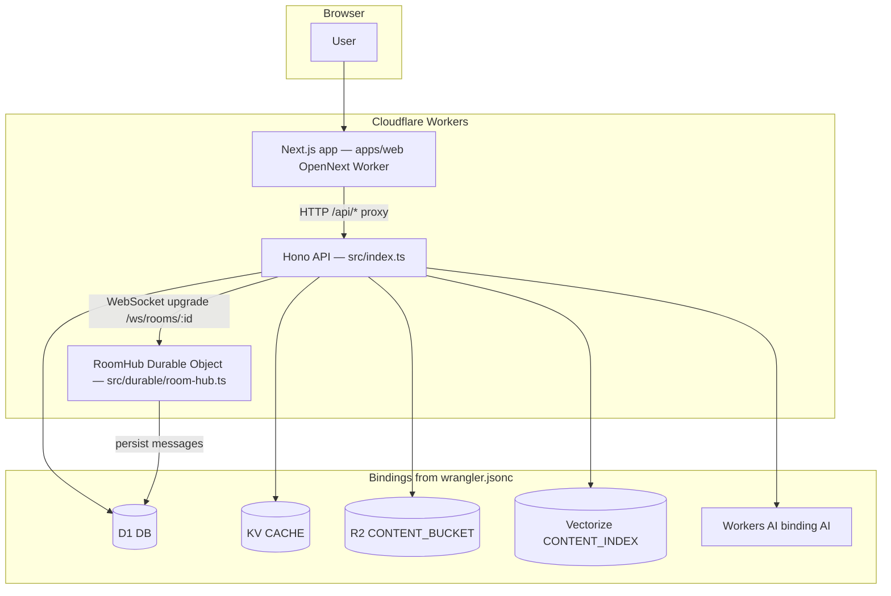
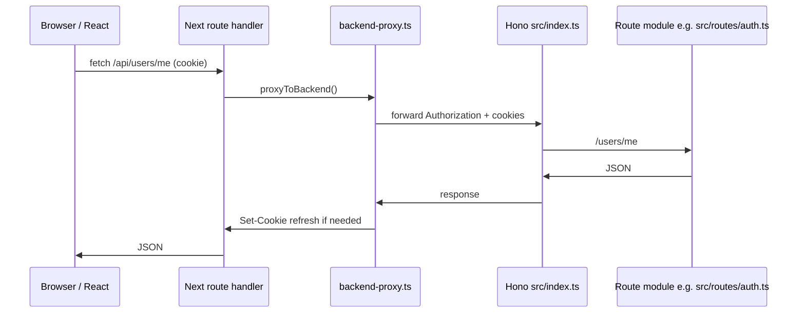
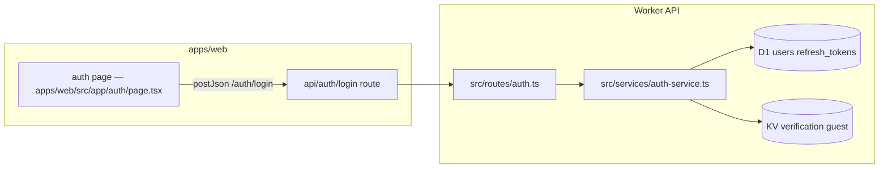
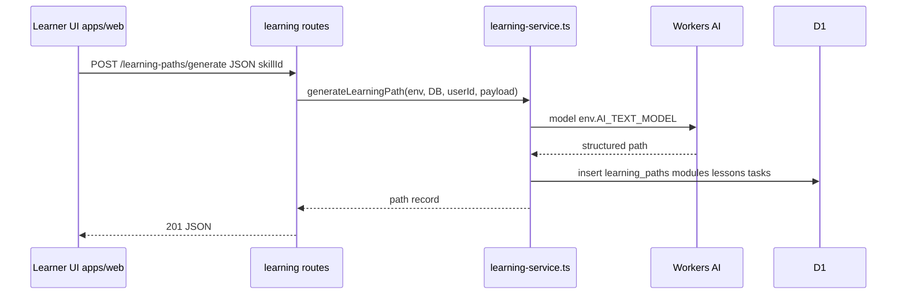
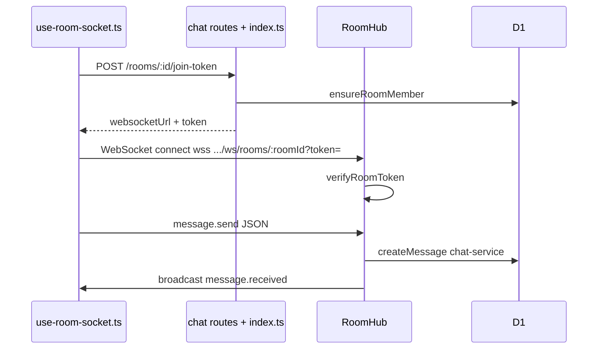
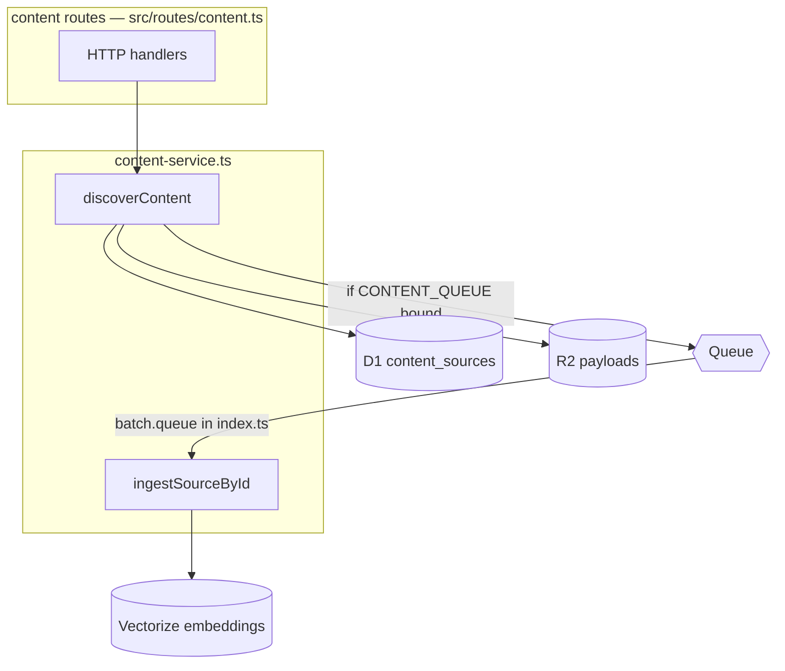
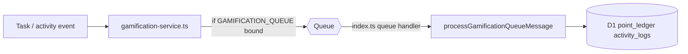

# SkillSet.ai Final Year Project Documentation

## 1. Problem Statement

Learners often struggle to move from scattered tutorials to structured progress. Existing platforms usually solve only one part of the problem:

- content libraries provide material but not grounded personalization
- chat tools provide collaboration but not learning structure
- project platforms provide execution space but not guided skill progression
- gamified systems provide motivation but not meaningful learning context

SkillSet.ai addresses this gap by combining AI-generated learning paths, semantic content discovery, peer matching, realtime collaboration, and project execution inside a single Cloudflare-native system.

## 2. Objectives

- Build a web-first platform that converts a skill goal into a structured learning path.
- Aggregate relevant learning content from documentation and video sources.
- Support personalized learning through user profile, skill inventory, and goal context.
- Enable learner-to-learner collaboration through matching and chat rooms.
- Track learning progress with tasks, points, badges, levels, and leaderboards.
- Deploy the full stack on Cloudflare using native services.

## 3. Scope

- Phase-appropriate modular monolith
- English-first MVP
- Email/password authentication
- Guest session support
- AI-assisted path generation and task feedback
- Peer rooms and project rooms
- Admin tooling for content and badge management

## 4. System Architecture

SkillSet.ai follows a Cloudflare-only production architecture.

- Next.js App Router frontend provides landing, auth, onboarding, dashboard, chat, leaderboard, profile, and admin flows.
- Hono-based Worker API exposes modular REST endpoints for every major domain.
- D1 stores relational application data.
- KV stores rate-limit buckets, verification tokens, guest-session state, and cached discovery results.
- R2 stores raw content payloads and frontend incremental cache assets.
- Vectorize stores content embeddings for semantic retrieval.
- Workers AI handles learning-path generation, submission feedback, and embeddings.
- Durable Objects manage room-level realtime state and WebSocket sessions.
- Queues process content ingestion and gamification events asynchronously.

## 5. High-Level Design

### 5.1 Major Subsystems

- Authentication subsystem
- User and profile subsystem
- Skill and content subsystem
- Learning engine subsystem
- Peer matching subsystem
- Realtime collaboration subsystem
- Gamification subsystem
- Admin subsystem
- Deployment and CI/CD subsystem

### 5.2 High-Level Flow

1. A learner authenticates or continues as a guest.
2. The learner defines profile details and skill intent.
3. The system discovers content sources and stores metadata.
4. The ingestion pipeline stores raw content, chunks it, and creates embeddings.
5. Workers AI generates a learning path using learner context plus retrieved content.
6. The learner enrolls, studies modules, submits tasks, and receives feedback.
7. Matching logic recommends peers with compatible goals and constraints.
8. Realtime rooms support messaging, collaboration, and project execution.
9. Activity logs and queue-driven processing update points, badges, and leaderboards.

## 6. Low-Level Design

### 6.1 Backend Modules

- `src/routes/auth.ts`: registration, login, refresh, logout, email verification, guest auth
- `src/routes/users.ts`: profile update, public profile, activity, skill replacement
- `src/routes/skills.ts`: list, search, detail
- `src/routes/content.ts`: discover, search, reindex, source detail
- `src/routes/learning.ts`: generate path, enroll, module detail, task submission
- `src/routes/projects.ts`: create, update, join, member listing
- `src/routes/matching.ts`: recommendations, accept, reject
- `src/routes/chat.ts`: room listing, room creation, messages, join token
- `src/routes/gamification.ts`: overview, badges, leaderboards
- `src/routes/admin.ts`: metrics, content source creation, badge creation, skill reindex

### 6.2 Service Layer

- `auth-service.ts`: user creation, refresh rotation, guest session creation, verification token handling
- `content-service.ts`: skill lookup, source discovery, R2 storage, Vectorize indexing, semantic lookup
- `learning-service.ts`: AI path generation, persistence of modules/lessons/tasks, task submission feedback
- `matching-service.ts`: recommendation scoring and match persistence
- `chat-service.ts`: room membership checks, room creation, persistent messaging
- `gamification-service.ts`: activity logs, point ledger updates, badge rules, leaderboard generation
- `project-service.ts`: project lifecycle and project-room integration
- `admin-service.ts`: metrics and curation helpers

### 6.3 Frontend Modules

- `apps/web/src/app/auth`: login, register, verify-email, guest entry
- `apps/web/src/app/onboarding`: profile and skill inventory flow
- `apps/web/src/app/dashboard`: overview, matches, rooms, progress
- `apps/web/src/app/skills`: skill search, discovery, and path generation
- `apps/web/src/app/learning-paths/[id]`: module overview and project launch
- `apps/web/src/app/modules/[id]`: lessons, content links, task submission
- `apps/web/src/app/chat`: room list plus realtime conversation
- `apps/web/src/app/projects/[id]`: members, project status, linked room
- `apps/web/src/app/profile`: profile editing and activity review
- `apps/web/src/app/leaderboard`: scoped leaderboard views
- `apps/web/src/app/admin`: admin metrics and curation flows

## 7. Database Schema

The core database is Cloudflare D1. The schema is implemented in `schema.sql`.

### 7.1 Identity and Profile Tables

- `users`
- `profiles`
- `refresh_tokens`
- `api_keys`

### 7.2 Skill and Learning Tables

- `skills`
- `user_skills`
- `learning_paths`
- `user_learning_paths`
- `modules`
- `lessons`
- `tasks`
- `task_attempts`

### 7.3 Content Tables

- `content_sources`
- `content_chunks`

### 7.4 Collaboration Tables

- `projects`
- `project_members`
- `chat_rooms`
- `chat_room_members`
- `messages`
- `peer_matches`

### 7.5 Gamification Tables

- `activity_logs`
- `point_ledger`
- `badge_definitions`
- `user_badges`
- `level_definitions`
- `leaderboard_snapshots`

## 8. API Design

### 8.1 Auth APIs

- `POST /auth/register`
- `POST /auth/login`
- `POST /auth/refresh`
- `POST /auth/logout`
- `GET /auth/me`
- `POST /auth/verify-email`
- `POST /auth/guest`

### 8.2 User APIs

- `GET /users/me`
- `PATCH /users/me`
- `PUT /users/me/skills`
- `GET /users/me/activity`
- `GET /profiles/:id`

### 8.3 Skill APIs

- `GET /skills`
- `GET /skills/search?q=`
- `GET /skills/:slug`

### 8.4 Learning APIs

- `POST /learning-paths/generate`
- `GET /learning-paths/:id`
- `POST /learning-paths/:id/enroll`
- `GET /modules/:id`
- `POST /tasks/:id/submit`

### 8.5 Content APIs

- `POST /content/discover`
- `GET /content/sources/:id`
- `POST /content/reindex`
- `GET /content/search?q=`

### 8.6 Project APIs

- `POST /projects`
- `GET /projects/:id`
- `POST /projects/:id/join`
- `PATCH /projects/:id`
- `GET /projects/:id/members`

### 8.7 Matching APIs

- `GET /matches/recommendations`
- `POST /matches/:id/accept`
- `POST /matches/:id/reject`

### 8.8 Chat APIs

- `GET /rooms`
- `POST /rooms`
- `GET /rooms/:id/messages`
- `POST /rooms/:id/messages`
- `POST /rooms/:id/join-token`
- `GET /ws/rooms/:roomId`

### 8.9 Gamification APIs

- `GET /gamification/me`
- `GET /badges`
- `GET /leaderboards`
- `GET /leaderboards/:scope`

### 8.10 Admin APIs

- `GET /admin/metrics`
- `POST /admin/content-sources`
- `POST /admin/badges`
- `POST /admin/reindex-skill`

## 9. Authentication and Security Design

- JWT access tokens are short-lived.
- Refresh tokens are hashed and rotated in D1.
- Email verification tokens are stored in KV.
- Guest sessions are temporary and validated through KV-backed state.
- Password hashing uses Argon2id.
- Rate limiting uses KV buckets keyed by IP and route family.
- Role-based checks protect admin operations.
- WebSocket room access is token-gated.
- Refresh cookies are handled through secure proxy routes on the frontend.

## 10. Technology Stack Justification

- `Next.js` was selected for structured routing, App Router support, and Cloudflare compatibility through OpenNext.
- `Hono` was selected for lightweight, modular REST APIs on Workers.
- `D1` was selected because the application is relational and Cloudflare-native.
- `KV` was selected for ephemeral tokens, caches, and rate-limit state.
- `R2` was selected for large unstructured payload storage.
- `Vectorize` was selected for semantic retrieval.
- `Workers AI` was selected to keep generation and embeddings inside the Cloudflare platform.
- `Durable Objects` were selected for room state and ordered realtime coordination.
- `Queues` were selected for asynchronous ingestion and gamification work.

## 11. Architecture diagrams (implementation-traced)

Each diagram below maps to **files and routes in this repository**. Mermaid renders in GitHub, VS Code, and most Markdown preview tools.

### 11.1 Production topology and Worker bindings

Cloudflare resources are declared in `wrangler.jsonc` and typed in `src/types.ts` (`AppBindings`). Queue consumers are wired in `src/index.ts` (`export default { fetch, queue }`).

### 11.2 Browser → Next.js → Hono request path

REST calls from the web app go through `apps/web/src/app/api/[...path]/route.ts`, which builds the upstream path (including `/api/skills/*` and squad chat paths) and forwards via `apps/web/src/lib/server/backend-proxy.ts` using `SKILLSET_API_BASE_URL`. The Hono app mounts routes in `src/index.ts`.

### 11.3 Authentication and session cookies

Auth endpoints live under `src/routes/auth.ts` and `src/services/auth-service.ts`. The Next layer stores httpOnly cookies (`skillset_access`, `skillset_refresh`) through dedicated handlers under `apps/web/src/app/api/auth/*` that also call the same backend.

### 11.4 Learning path generation (REST trace)

`POST /learning-paths/generate` is defined in `src/routes/learning.ts` and implemented in `src/services/learning-service.ts`. It uses `env.AI` and `env.DB` per `AppBindings`.

### 11.5 Realtime chat: join token, WebSocket, Durable Object

HTTP messaging: `src/routes/chat.ts` (`POST /rooms/:id/messages`) calls `createMessage` then `broadcastRoomEvent`. WebSocket: `GET /ws/rooms/:roomId` in `src/index.ts` forwards to `RoomHub` (`src/durable/room-hub.ts`). The client requests a token from `POST /rooms/:id/join-token` and opens the socket in `apps/web/src/hooks/use-room-socket.ts`.

### 11.6 Content discovery, R2, Vectorize, optional queue

`src/services/content-service.ts` writes metadata to D1, blobs to `CONTENT_BUCKET`, vectors to `CONTENT_INDEX`, and **optionally** enqueues work on `CONTENT_QUEUE` when that binding exists. The queue consumer in `src/index.ts` calls `ingestSourceById` and `discoverContent` for `reindex_skill` messages.

### 11.7 Gamification async path (optional queue)

`src/services/gamification-service.ts` may send messages to `GAMIFICATION_QUEUE`. `src/index.ts` `queue()` dispatches to `processGamificationQueueMessage` when the message is not a content type.

## 12. Deployment Design

- Backend deploys as a Cloudflare Worker using Wrangler.
- Frontend deploys as an OpenNext-generated Cloudflare Worker.
- CI validates backend and frontend independently.
- CD deploys API first, then frontend.
- Runtime URLs are injected during deployment using CI secrets.

## 13. Validation Summary

The completed implementation was validated through:

- full backend lint and typecheck
- full frontend lint and typecheck
- backend Worker dry-run bundle with Wrangler
- frontend production build with Next.js

OpenNext adapter bundling on Windows is less reliable than Linux, so final Cloudflare deployment is intended to run through Linux-based GitHub Actions.

## 14. Future Scope

- stronger adaptive personalization using performance history
- richer cohort support with explicit cohort entities
- signed R2 upload flows for message attachments
- mentor assistance and guided review flows
- moderation, reporting, and analytics dashboards
- richer recommendation scoring using profile embeddings

## 15. Conclusion

SkillSet.ai demonstrates a complete Cloudflare-native learning system that moves beyond static course delivery. It unifies content retrieval, path generation, collaboration, and motivation into one deployable architecture. The implementation remains modular, production-oriented, and aligned to the project’s academic and practical goals.
